# Tech Challenge FIAP - Sistema de Autoatendimento SOAT10

Este projeto foi desenvolvido durante a **Fase IV** do curso de **Arquitetura de Software** da FIAP, como requisito para avaliação. O sistema implementa uma solução completa de autoatendimento para uma lanchonete, utilizando arquitetura de microsserviços em nuvem.

## 👨‍💻 Desenvolvedor

- **Thallis André Faria Moreira** - RM360145

## 📹 Demonstrações em Vídeo

### Fase 4 - Microsserviços e Mensageria
- [Assistir no YouTube](https://youtu.be/)
## 📦 Repositórios da Solução

A solução está organizada em **10 repositórios** especializados:

### 📚 Documentação Central
- **[fiap-food-docs](https://github.com/thallis-andre/fiap-food-docs)**: Documentação completa da solução

### 🔧 Infraestrutura como Código
- **[fiap-food-kubernetes](https://github.com/thallis-andre/fiap-food-kubernetes)**: Cluster EKS com Terraform
- **[fiap-food-gateway](https://github.com/thallis-andre/fiap-food-gateway)**: API Gateway AWS com mapeamentos
- **[fiap-food-database](https://github.com/thallis-andre/fiap-food-database)**: PostgreSQL RDS com Terraform
- **[fiap-food-mongodb](https://github.com/thallis-andre/fiap-food-mongodb)**: MongoDB Atlas com Terraform
- **[fiap-food-rabbitmq](https://github.com/thallis-andre/fiap-food-rabbitmq)**: RabbitMQ no Kubernetes

### 🚀 Aplicações e Serviços
- **[fiap-food-lambda](https://github.com/thallis-andre/fiap-food-lambda)**: Serviço de autenticação serverless
- **[fiap-food-orders](https://github.com/thallis-andre/fiap-food-orders)**: Microsserviço de pedidos
- **[fiap-food-payments](https://github.com/thallis-andre/fiap-food-payments)**: Microsserviço de pagamentos
- **[fiap-food-preparation](https://github.com/thallis-andre/fiap-food-preparation)**: Microsserviço de preparação
- 
## 🏗️ Arquitetura da Solução

### Visão Geral da Arquitetura de Microsserviços

A aplicação foi refatorada de um monolito para uma arquitetura de microsserviços distribuídos, seguindo os princípios de Domain-Driven Design (DDD) e Clean Architecture.

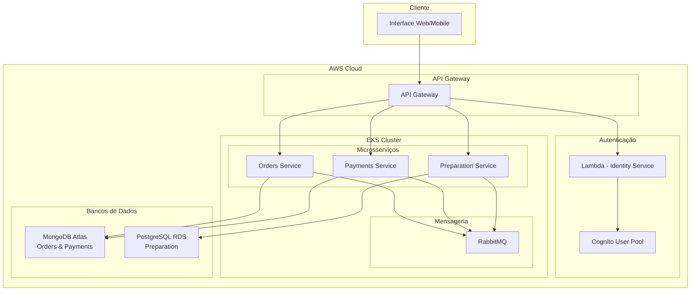

### Microsserviços Implementados

#### 1. 🍔 Orders Service
- **Responsabilidade**: Gerenciar pedidos e itens do cardápio
- **Banco de Dados**: MongoDB (NoSQL)
- **Tecnologia**: NestJS, TypeScript, Mongoose
- **Funcionalidades**:
  - CRUD de pedidos
  - Gerenciamento de itens do cardápio
  - Estados do pedido (PENDING, CONFIRMED, PREPARING, READY, DELIVERED)
  - Comunicação via eventos com outros serviços

#### 2. 💳 Payments Service
- **Responsabilidade**: Processar pagamentos via PIX
- **Banco de Dados**: MongoDB (NoSQL)
- **Tecnologia**: NestJS, TypeScript, Mongoose
- **Funcionalidades**:
  - Integração com Mercado Pago
  - Geração de QR Codes PIX
  - Processamento de webhooks
  - Estados do pagamento (PENDING, APPROVED, REJECTED)

#### 3. 🍳 Preparation Service
- **Responsabilidade**: Gerenciar preparação de pedidos
- **Banco de Dados**: PostgreSQL (SQL)
- **Tecnologia**: NestJS, TypeScript, TypeORM
- **Funcionalidades**:
  - Fila de preparação para a cozinha
  - Controle de tempos de preparação
  - Estados da preparação (RECEIVED, PREPARING, READY, COMPLETED)
  - Notificações para o cliente

#### 4. 🔐 Identity Service
- **Responsabilidade**: Autenticação e autorização
- **Tecnologia**: AWS Lambda, TypeScript, Cognito
- **Funcionalidades**:
  - Cadastro de usuários
  - Autenticação JWT
  - Integração com Cognito
  - Validação de CPF e e-mail

## 🔄 Comunicação entre Microsserviços

### Padrões de Mensageria Implementados

- **Event Sourcing**: Eventos de domínio para mudanças de estado
- **Saga Pattern**: Coordenação de transações distribuídas
- **Publisher/Subscriber**: Comunicação assíncrona via RabbitMQ

### Fluxo de Eventos

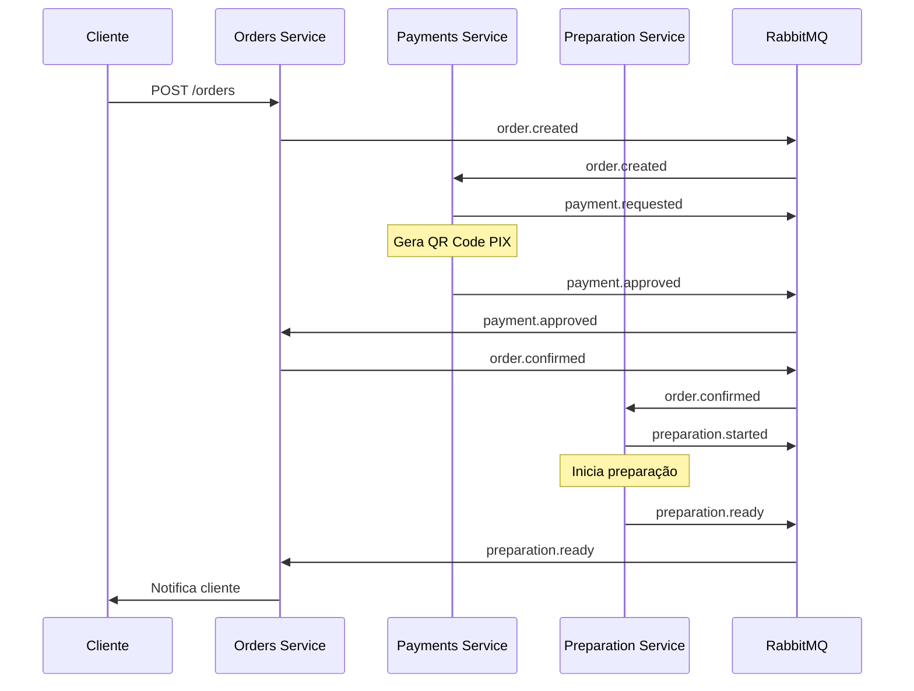

## 📊 Event Storming

### Fluxo de Eventos Completo
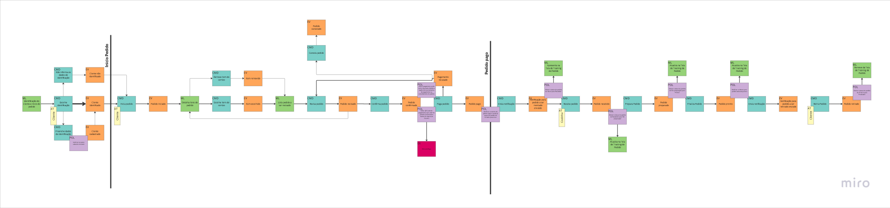

### Agregados de Domínio
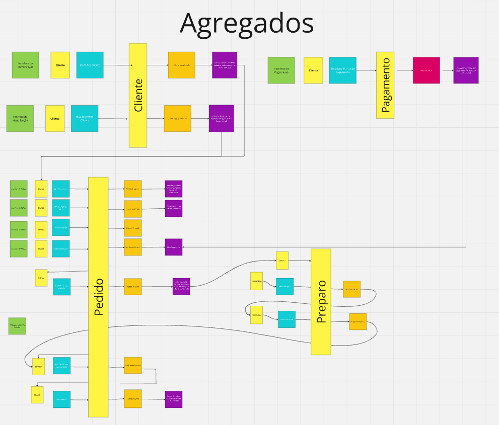

## ☁️ Infraestrutura na AWS

### Arquitetura na Nuvem
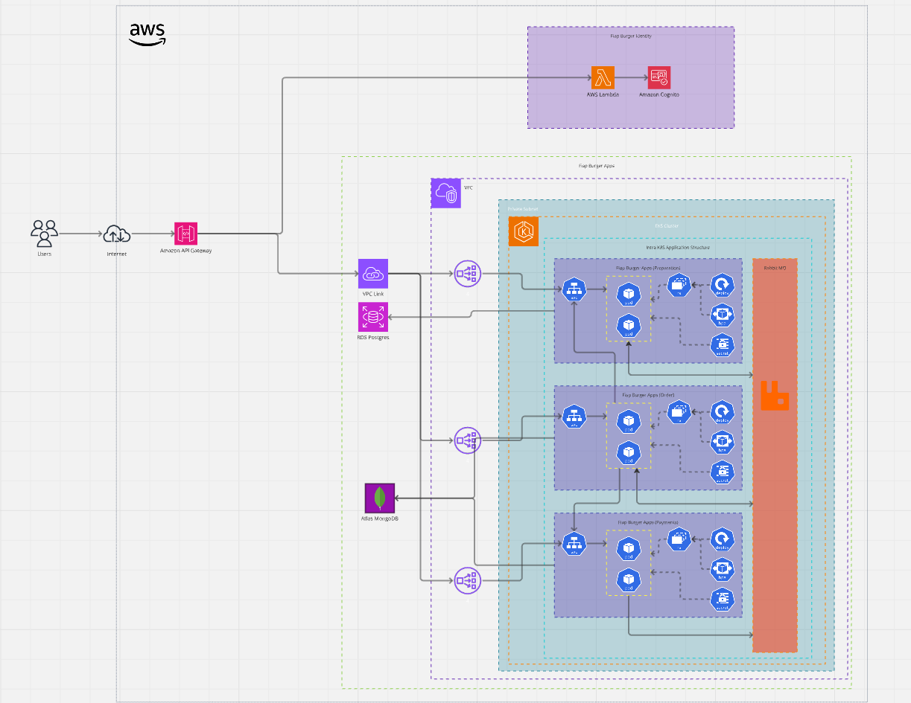

### Componentes de Infraestrutura

#### Compute
- **EKS Cluster**: Orquestração dos microsserviços
- **Lambda**: Serviço de autenticação serverless
- **EC2**: Nodes do cluster Kubernetes

#### Storage
- **MongoDB Atlas**: Banco NoSQL para Orders e Payments
- **PostgreSQL RDS**: Banco SQL para Preparation
- **S3**: Armazenamento de arquivos e backups

#### Network
- **API Gateway**: Porta de entrada única para todos os serviços
- **Application Load Balancer**: Distribuição de tráfego no EKS
- **VPC**: Rede isolada para os recursos

#### Security
- **Cognito**: Identity Provider para autenticação
- **IAM**: Controle de acesso e permissões
- **Security Groups**: Firewall para recursos

## 🗄️ Modelagem de Dados

### Visão Geral dos Bancos
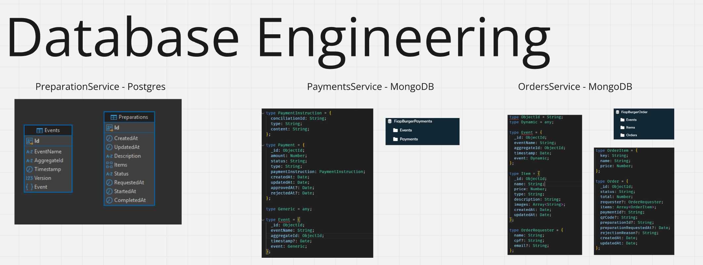

### Estratégia de Dados por Domínio

#### Orders Service (MongoDB)
- **Collection**: orders, items
- **Padrão**: Document-oriented para flexibilidade
- **Justificativa**: Estrutura de dados dinâmica, consultas complexas

#### Payments Service (MongoDB)
- **Collection**: payments, webhooks
- **Padrão**: Document-oriented para auditoria
- **Justificativa**: Logs de transações, integrações externas

#### Preparation Service (PostgreSQL)
- **Tables**: preparations, preparation_history
- **Padrão**: Relacional para consistência
- **Justificativa**: Dados estruturados, integridade referencial

## 🧪 Qualidade e Testes

### Cobertura de Testes
Todos os microsserviços mantêm **cobertura mínima de 80%** com os seguintes tipos de teste:

#### Tipos de Teste Implementados
- ✅ **Testes Unitários**: Jest para lógica de negócio
- ✅ **Testes de Integração**: Supertest para APIs
- ✅ **Testes BDD**: Cucumber para cenários de negócio
- ✅ **Testes de Aceitação**: End-to-end automatizados

### Ferramentas de Qualidade
- **SonarQube**: Análise de código estático
- **Jest**: Framework de testes
- **Cucumber**: Testes comportamentais
- **Supertest**: Testes de integração HTTP

## 🚀 CI/CD e Deploy

### Pipeline de Deploy
Todos os repositórios possuem pipelines automatizados com:

1. **Análise de Código**: ESLint + SonarQube
2. **Testes**: Unitários, Integração e BDD
3. **Build**: Docker + TypeScript
4. **Deploy**: Kubernetes via GitHub Actions
5. **Verificação**: Health checks e smoke tests

### Proteção de Branches
- ✅ Branch `main` protegida
- ✅ Pull Request obrigatório com 2 aprovações
- ✅ Status checks devem passar (CI/CD)
- ✅ SonarQube quality gate (70% coverage mínimo)

## 🌐 APIs e Documentação

### Swagger/OpenAPI
Cada microsserviço possui documentação interativa:

- **Orders API**: [Ver Swagger](./docs/swagger/orders.openapi.yaml)
- **Payments API**: [Ver Swagger](./docs/swagger/payments.openapi.yaml)
- **Preparation API**: [Ver Swagger](./docs/swagger/preparation.openapi.yaml)

### Collection do Postman
Collection automatizada para testes: [Acessar Postman](https://www.postman.com/gm50x/workspace/7soat31/folder/10261834-ead661be-6140-4298-ac6a-380fa0c3c5b3?action=share&source=copy-link&creator=10261834&ctx=documentation)

## 🎯 Requisitos Atendidos

### ✅ Requisitos Funcionais
- **Cadastro de Clientes**: Via Identity Service (Lambda + Cognito)
- **Gerenciamento de Produtos**: CRUD completo por categoria
- **Gestão de Pedidos**: Ciclo completo do pedido
- **Processamento de Pagamentos**: PIX via Mercado Pago
- **Acompanhamento de Preparação**: Estados em tempo real
- **Notificações**: Cliente informado em cada etapa

### ✅ Requisitos Não Funcionais
- **Microsserviços**: 3 principais (Orders, Payments, Preparation)
- **Bancos de Dados**: MongoDB (NoSQL) + PostgreSQL (SQL)
- **Mensageria**: RabbitMQ para comunicação assíncrona
- **Cloud**: AWS (EKS, Lambda, RDS, etc.)
- **IaC**: Terraform para toda infraestrutura
- **CI/CD**: GitHub Actions com pipelines automatizados
- **Testes**: 80% de cobertura + BDD
- **Monitoramento**: CloudWatch + Application logs

## 📈 Evidências de Qualidade

### 🍔 Orders Service

#### Pipeline de Deploy
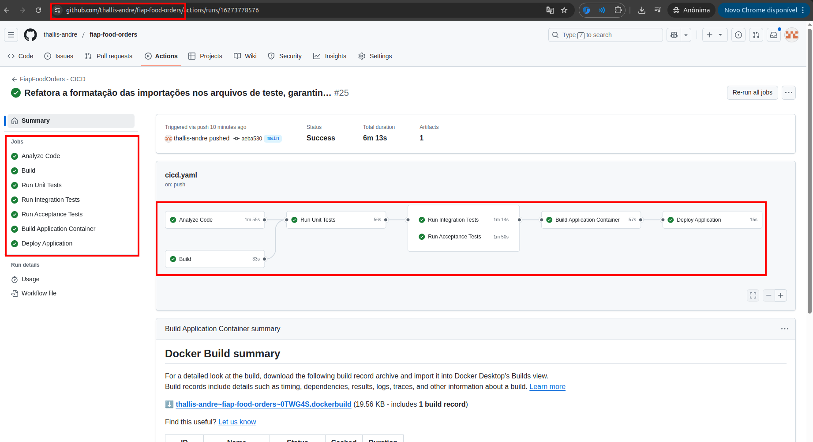

#### Testes Unitários

#### Testes de Integração
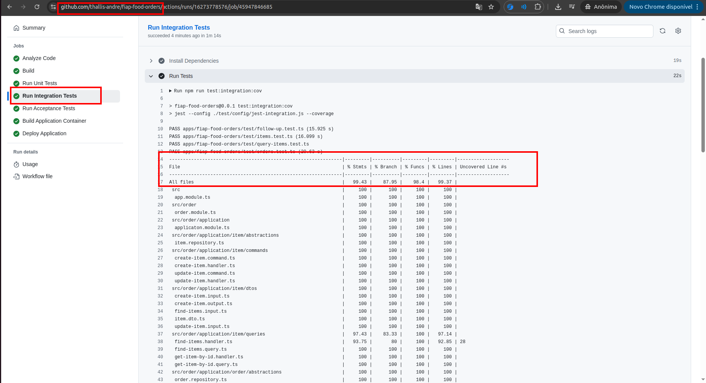

#### Testes BDD
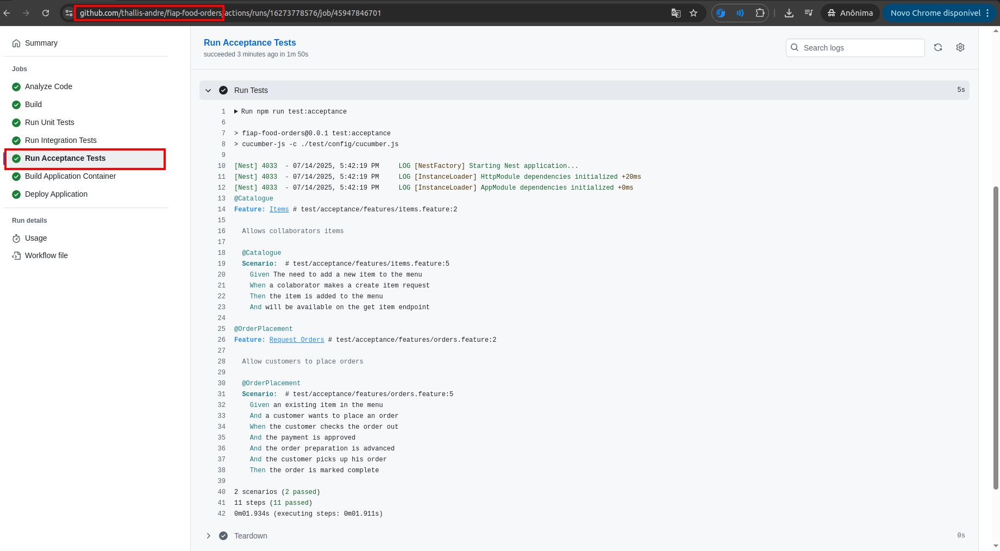

### 🍳 Preparation Service

#### Pipeline de Deploy
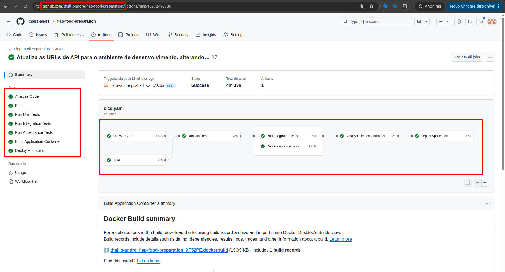

#### Testes Unitários
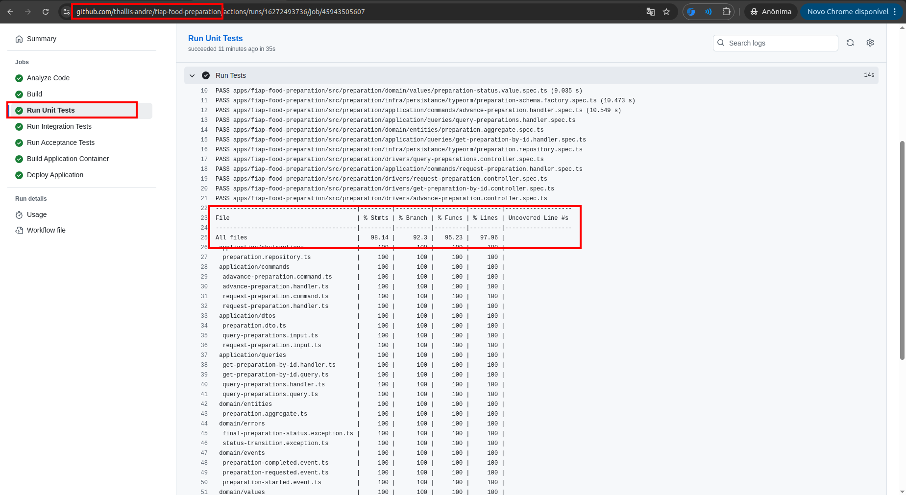

#### Testes de Integração
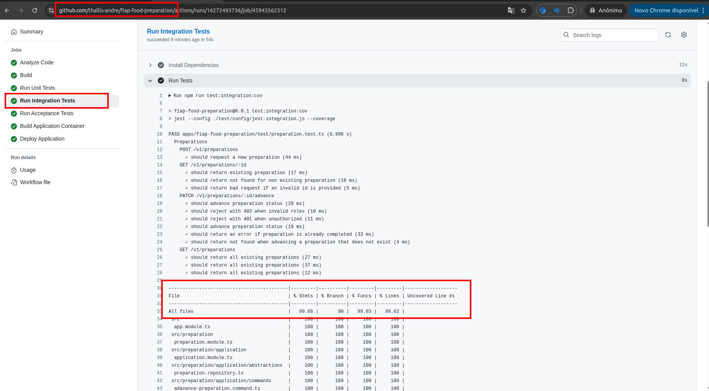

#### Testes BDD
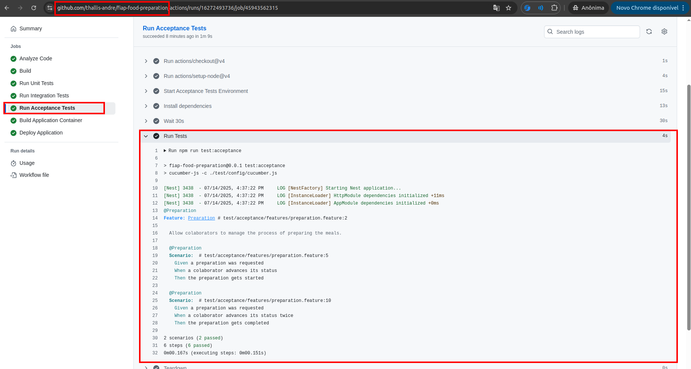

### 💳 Payments Service

#### Pipeline de Deploy
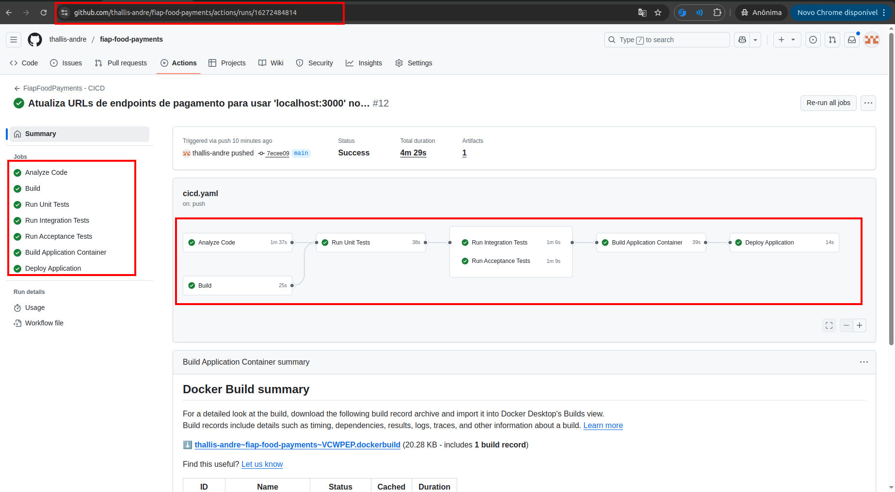

#### Testes Unitários
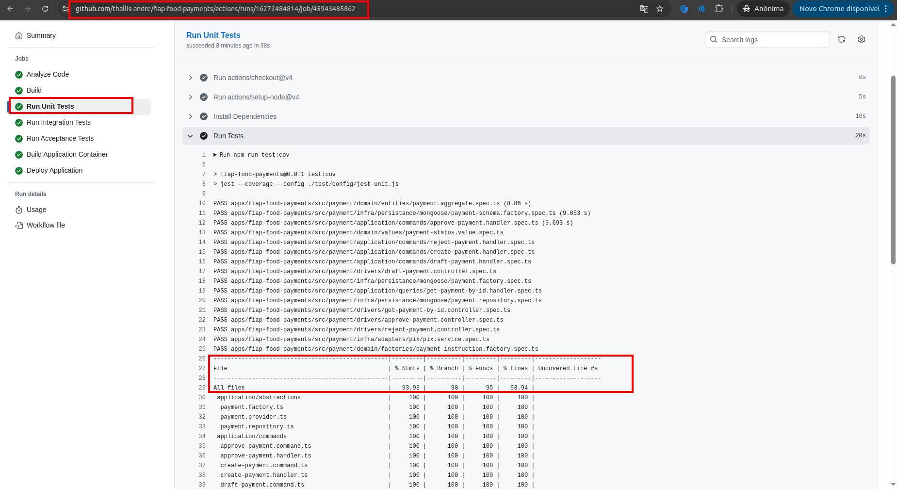

#### Testes de Integração
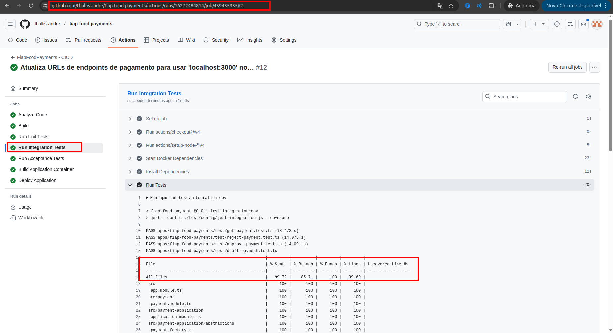

#### Testes BDD
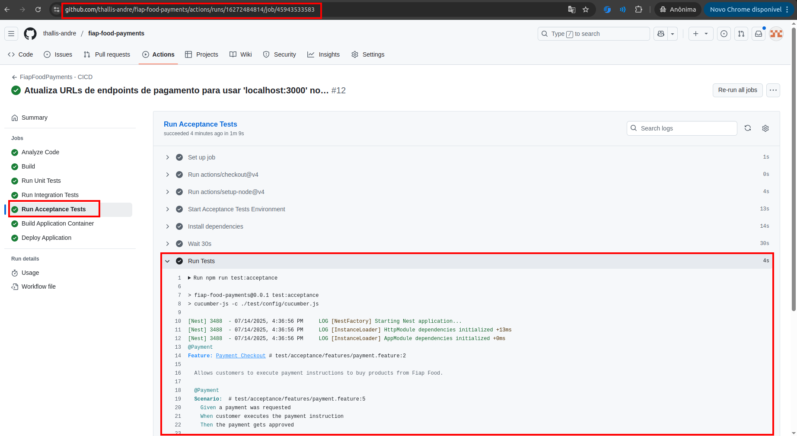

## 📊 Métricas de Performance

### Latência dos Microsserviços
- **Orders Service**: ~150ms (P95)
- **Payments Service**: ~200ms (P95)
- **Preparation Service**: ~100ms (P95)
- **Identity Service**: ~300ms (Cold Start), ~50ms (Warm)

### Throughput
- **Pedidos simultâneos**: 100 RPS
- **Pagamentos processados**: 50 RPS
- **Preparações simultâneas**: 20 RPS

## 🔍 Monitoramento e Observabilidade

### Logs Estruturados
- **Formato**: JSON estruturado
- **Correlação**: Request ID em todos os logs
- **Níveis**: DEBUG, INFO, WARN, ERROR

### Métricas de Negócio
- **Pedidos criados**: Counter
- **Pagamentos aprovados**: Counter
- **Tempo de preparação**: Histogram
- **Erros por endpoint**: Counter

### Alertas Configurados
- **Latência alta**: P95 > 500ms
- **Taxa de erro**: > 5%
- **Recursos**: CPU > 80%, Memory > 80%
- **Filas**: Mensagens acumuladas > 100

## 🛡️ Segurança

### Autenticação e Autorização
- **JWT Tokens**: Cognito como IdP
- **Roles**: Customer, Admin
- **Validações**: CPF, E-mail, Payloads

### Segurança de Rede
- **VPC**: Rede isolada
- **Security Groups**: Firewall granular
- **TLS**: Criptografia em trânsito
- **Secrets**: AWS Secrets Manager

## 🔄 Escalabilidade

### Horizontal Pod Autoscaler
- **Métrica**: CPU 70%
- **Min Replicas**: 2
- **Max Replicas**: 10
- **Scale Down**: 5 minutos

### Cluster Autoscaler
- **Nodes**: 1-3 instâncias
- **Tipo**: t3.medium
- **Scaling**: Baseado em recursos

## 📝 Conclusão

O projeto evoluiu de um monolito para uma arquitetura robusta de microsserviços, implementando as melhores práticas de:

- **Domain-Driven Design**: Bounded contexts bem definidos
- **Event Sourcing**: Comunicação assíncrona resiliente
- **DevOps**: CI/CD completamente automatizado
- **Observabilidade**: Logs, métricas e alertas
- **Qualidade**: Testes abrangentes e cobertura adequada

A solução está pronta para produção e pode escalar conforme a demanda do negócio, mantendo alta disponibilidade e performance.
